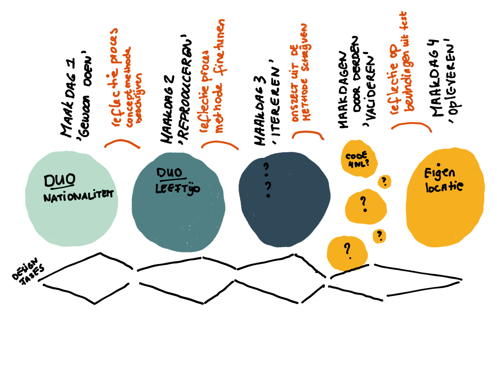

# De opdracht

## Aanleiding en onderzoeksvraag

Nu steeds vaker wordt gesproken over *toezicht op algoritmen* is het belangrijk om te weten hoe een onderzoek naar algoritmen door derden uitgevoerd kan worden op zo’n manier dat de dagelijkse uitvoeringsprocessen niet verstoord worden.

Dit terrein is nog vrij onbekend. De Algemene rekenkamer heeft een onderzoek gedaan naar de wijze waarop de belastingdienst risicogericht werkt[1](#sdfootnote1sym) . De Auditdienst Rijk en accountantskantoren zijn zich aan het voorbereiden op deze nieuwe taak.[2](#sdfootnote2sym) De Algemene rekenkamer heeft een toetsingskader ontwikkeld.[3](#sdfootnote3sym) Recent heeft de Raad van State een rapport uitgebracht over o.a. geautomatiseerde wetsuitvoering. [4](#sdfootnote4sym)

Maar wat geschikt is voor een financiële deskundige, werkt misschien niet voor een onderzoeker die een juridische check wil doen. Ook is het voor een uitvoeringsorganisatie vervelend als verschillende disciplines en organisaties zich op verschillende momenten over de wijze van ontwikkelen en het gebruik van de algoritmen buigen en de uitvoering belasten met vragen. Zowel voor onderzoekers, als voor uitvoeringsorganisaties lijkt een meer integrale aanpak noodzakelijk. Bijkomend voordeel is dat hierdoor voor uitvoeringsorganisaties duidelijker wordt welke beslissingen en keuzen tijdens de ontwikkeling gedocumenteerd moeten worden op een manier die een review mogelijk maakt.

Om te komen tot zo’n werkmethode is niet eenvoudig. Niet alle organisaties hebben een set algoritmen/beslisregels in natuurlijke taal voorhanden maar alleen de beschikking over computercode die nauwelijks leesbaar is voor leken. Het komt ook voor dat organisaties software (of het gebruik van software) hebben aangeschaft waarmee wetten worden uitgevoerd en waarbij de leverancier als enige de inhoudelijke kennis in huis heeft. Maar, er zijn ook uitvoeringsinstellingen die de beslisregels in natuurlijke taal in de la hebben liggen. Dit gegeven, of belofte (?) heeft geleid tot het
idee om deze documenten te gaan onderzoeken.

[1](#sdfootnote1anc) [Datagedreven selectie van aangiften door de Belastingdienst | Rapport | Algemene Rekenkamer](https://www.rekenkamer.nl/publicaties/rapporten/2019/06/11/datagedreven-selectie-van-aangiften-door-de-belastingdienst)

[2](#sdfootnote2anc) [Wie controleert de hogepriesters van de AI algoritmen? - Smarthealth](https://www.smarthealth.nl/2018/06/04/wie-controleert-ai-artificial-intelligence-zorg/)

[3](#sdfootnote3anc) [Wat is het toetsingskader | Algoritmes | Algemene Rekenkamer](https://www.rekenkamer.nl/onderwerpen/algoritmes/algoritmes-toetsingskader)

[4](#sdfootnote4anc) [Publicatie Raad van State over digitalisering in wetgeving en bestuursrechtspraak - Raad van State](https://www.raadvanstate.nl/@125918/publicatie-digitalisering/)

## Aanpak en uitgangspunten

### *Aanpak*

Om ergens te kunnen starten willen wij aan de hand van deze beslisregels of andere vormen van beschrijvingen met medewerkers van uitvoeringsinstellingen ontdekken wat een geschikte onderzoeksmethode zou zijn. Hierdoor wordt geborgd dat het resultaat (het opleveren van een multidisciplinaire werkmethode) aansluit bij de praktijk. Bijkomend voordeel is er ook voor de uitvoeringsinstellingen. Door dit onderzoek te faciliteren, wordt voorkomen dat er later vanuit een hiërarchische positie eisen aan de uitvoering gesteld worden die de uitvoering eerder hinderen dan faciliteren. Ook kan het leiden tot een pool van deskundigen die elkaars processen beoordelen (denk aan een gateway review). Dit betekent dat het lerend vermogen van de overheid toe kan nemen.

### *Doel*

Het doel is dus: een werkmethode ontwikkelen voor het doen van onderzoek door derden naar de ontwikkeling van algoritmen en het gebruik van algoritmen door een overheidsorganisatie. Het is de bedoeling dat met de werkmethode derden in staat zijn zich een oordeel te vormen over de algoritmische uitvoering door de uitvoeringsinstellingen. Daarvoor is bijgaand denkschema geformuleerd.

- We bestuderen hoe de ontwikkeling en het gebruik van algoritmen gelijktijdig juridisch, financieel en modelmatig onderzocht kan worden [topic]

- omdat we willen weten welke discipline welke onderzoeksvragen beantwoord zou willen zien [rationale] 

- zodat we begrijpen wat de minst belastende aanpak is voor een multidisciplinaire en integrale beoordeling [significance]. 

Om het onderzoek voldoende concreet maar ook behapbaar te houden stellen we voor dat de werkmethode aan de volgende vier doelstellingen moet voldoen:

- de werkmethode stelt een jurist in staat een uitspraak te doen over de rechtmatigheid en behoorlijkheid van het systeem,

- de werkmethode stelt een informatiekundige in staat een uitspraak te doen over de kwaliteit van het systeem

- de werkmethode stelt een accountant of interne controller in staat een uitspraak te doen over …[nog in te vullen],

- de werkmethode is geschikt voor herhaald gebruik in verschillende publieke organisaties.

### *Wijze van het onderzoek*

De werkmethode zal werkende weg worden ontwikkeld door het kernteam en enthousiastelingen die deskundig zijn en het leuk vinden om te leren van andere disciplines. Hierbij zal vooral gebruik worden gemaakt van de inzet en tijd van de medewerkers van de uitvoeringsinstellingen zelf. Zij kennen de uitvoering en de dilemma’s. Er wordt alleen gekeken naar een bestaande geautomatiseerde uitvoering van wetgeving door middel van vaste algoritmen. Dit betekent dat we niet kijken naar lerende algoritmen zoals toepassingen met machine learning. We willen via de Manifestgroep zorgen voor een zo breed mogelijk bereik.

## Resultaat

Door de onderzoeksgroep wordt verslag gedaan van het onderzoek in begrijpelijke taal en beeld en wordt een werkmethode opgeleverd. Hier wordt veel aandacht besteed aan visualisatie van het onderzoeksproces. Omdat naar bestaande uitvoeringsprocessen wordt gekeken, is een bijkomend product een beoordeling van het gebruik van algoritmen hierbij maar dit is geen hoofddoel maar een stap om tot het hoofddoel te komen.
